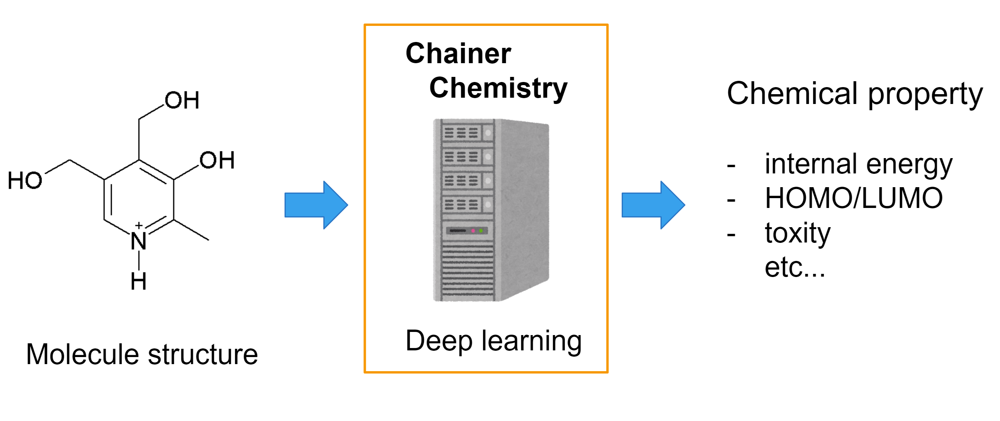

# Chainer Chemistry: A Library for Deep Learning in Biology and Chemistry

[](https://pypi.python.org/pypi/chainer-chemistry)
[](https://github.com/pfnet-research/chainer-chemistry/blob/master/LICENSE)
[](https://travis-ci.org/pfnet-research/chainer-chemistry)
[](http://chainer-chemistry.readthedocs.io/en/latest/?badge=latest)

<p align="center">
  
</p>

Chainer Chemistry is a deep learning framework (based on Chainer) with
applications in Biology and Chemistry. It supports various state-of-the-art
models (especially GCNN - Graph Convolutional Neural Network) for chemical property prediction.

For more information, please refer to the [documentation](http://chainer-chemistry.readthedocs.io/en/latest/index.html).
Also, a quick introduction to deep learning for molecules and Chainer Chemistry
is available [here](https://www.slideshare.net/KentaOono/deep-learning-for-molecules-introduction-to-chainer-chemistry-93288837).

## Dependencies

Chainer Chemistry depends on the following packages:

 - [`chainer`](https://docs.chainer.org/en/stable/index.html)
 - [`pandas`](https://pandas.pydata.org)
 - [`scikit-learn`](http://scikit-learn.org/stable/)
 - [`tqdm`](https://pypi.python.org/pypi/tqdm)
 - [`h5py`](https://pypi.python.org/pypi/h5py)

These are automatically added to the system when installing the library via the
`pip` command (see _Installation_). However, the following  needs to be
installed manually:

 - [`rdkit (release 2019.03.2.0)`](https://github.com/rdkit/rdkit)

Please refer to the RDKit [documentation](http://www.rdkit.org/docs/Install.html)
for more information regarding the installation steps.

Note that only the following versions of Chainer Chemistry's dependencies are
currently supported:

| Chainer Chemistry   | Chainer         | RDKit          | Python           |
| ------------------: | --------------: | -------------: | ---------------: |
| v0.1.0 ~ v0.3.0     | v2.0 ~ v3.0     | 2017.09.3.0    | 2.7, 3.5, 3.6    |
| v0.4.0              | v3.0 ~ v4.0 *1  | 2017.09.3.0    | 2.7, 3.5, 3.6    |
| v0.5.0              | v3.0 ~ v5.0 *2  | 2017.09.3.0    | 2.7, 3.5, 3.6    |
| v0.6.0              | v6.0 ~      *3  | 2017.09.3.0    | 2.7, 3.5, 3.6    |
| v0.7.0 ~ v0.7.1     | v7.0 ~          | 2019.03.2.0    | 3.6, 3.7      *4 |
| master branch    *5 | v7.0 ~          | 2019.03.2.0    | 3.6, 3.7         |


[Footnote]

*1: We used `FunctionNode` in [this PR](https://github.com/pfnet-research/chainer-chemistry/pull/190),
which is introduced after chainer v3. See [this issue](https://github.com/pfnet-research/chainer-chemistry/issues/192) for details.

*2: Saliency modules only work after chainer v5.

*3: Chainer v6 is released and [ChainerX](https://chainer.org/announcement/2018/12/03/chainerx.html) is newly introduced.
    In order to support this new feature & API, we broke backward compatibility for chainer chemistry v0.6.0 release.
    See [ChainerX Documentation](https://chainer.org/announcement/2018/12/03/chainerx.html) for details.

*4: python 2.x support is dropped, following the same policy with `chainer` and `rdkit`.

*5: As [announced in chainer blog](https://chainer.org/announcement/2019/12/05/released-v7.html),
    further development will be limited to only serious bug-fixes and maintenance.

## Installation

Chainer Chemistry can be installed using the `pip` command, as follows:

```
pip install chainer-chemistry
```

Example to install rdkit with conda:
```bash
# newer conda version is necessary to install rdkit 2019.03.2.0
conda install -n base conda==4.6.14
conda install -c rdkit rdkit==2019.03.2.0
```

If you would like to use the latest sources, please checkout the master branch
and install with the following commands:

```
git clone https://github.com/pfnet-research/chainer-chemistry.git
pip install -e chainer-chemistry
```

## Sample Code

Sample code is provided with this repository. This includes, but is not limited
to, the following:

- Training a new model on a given dataset
- Performing inference on a given dataset, using a pretrained model
- Evaluating and reporting performance metrics of different models on a given
dataset

Please refer to the `examples` directory for more information.

## Supported Models

The following graph convolutional neural networks are currently supported:

- NFP: Neural Fingerprint [2, 3]
- GGNN: Gated Graph Neural Network [4, 3]
- WeaveNet [5, 3]
- SchNet [6]
- RSGCN: Renormalized Spectral Graph Convolutional Network [10]<br/>
 \* The name is not from the original paper - see [PR #89](https://github.com/pfnet-research/chainer-chemistry/pull/89) for the naming convention.
- RelGCN: Relational Graph Convolutional Network [14]
- GAT: Graph Attention Networks [15]
- GIN: Graph Isomorphism Networks [17]
- MPNN: Message Passing Neural Networks [3]
- Set2Set [19]
- GNN-FiLM: Graph Neural Networks with Feature-wise Linear Modulation [20]
- MEGNet: MatErials Graph Network [24]
- CGCNN: Crystal Graph Convolutional Neural Networks [25]

We test supporting the brand-new Graph Warp Module (GWM) [18]-attached models for:
- NFP ('nfp_gwm')
- GGNN ('ggnn_gwm')
- RSGCN ('rsgcn_gwm')
- GIN ('gin_gwm')

In the directory `examples/molnet_wle`, we have implemented the new preprocessing ''Weisfeiler-Lehman Embedding for Molecular Graph Neural Networks'' [26] for several GNN architectures. Please find the Readme in that directory for the usage and the details. 

## Supported Datasets

The following datasets are currently supported:

### Chemical
- QM9 [7, 8]
- Tox21 [9]
- MoleculeNet [11]
- ZINC (only 250k dataset) [12, 13]
- User (own) dataset

### Network
- cora [21]
- citeseer [22]
- reddit [23]

## Research Projects

If you use Chainer Chemistry in your research, feel free to submit a
pull request and add the name of your project to this list:

 - BayesGrad: Explaining Predictions of Graph Convolutional Networks ([paper](https://arxiv.org/abs/1807.01985), [code](https://github.com/pfnet-research/bayesgrad))
 - Graph Warp Module: an Auxiliary Module for Boosting the Power of Graph Neural Networks ([paper](https://arxiv.org/abs/1902.01020), [code](https://github.com/k-ishiguro/chainer-chemistry/tree/gwm_for_CC))
 - GraphNVP: An Invertible Flow Model for Generating Molecular Graphs ([paper](https://arxiv.org/abs/1905.11600), [code](https://github.com/pfnet-research/graph-nvp))
 - Graph Residual Flow for Molecular Graph Generation ([paper](https://arxiv.org/abs/1909.13521))

## Useful Links

Chainer Chemistry:

 - [Documentation](https://chainer-chemistry.readthedocs.io)
 - [Research Blog](https://preferredresearch.jp/2017/12/18/chainer-chemistry-beta-release/)

Other Chainer frameworks:

 - [Chainer: A Flexible Framework of Neural Networks for Deep Learning](https://chainer.org/)
 - [ChainerRL: Deep Reinforcement Learning Library Built on Top of Chainer](https://github.com/chainer/chainerrl)
 - [ChainerCV: A Library for Deep Learning in Computer Vision](https://github.com/chainer/chainercv)
 - [ChainerMN: Scalable Distributed Deep Learning with Chainer](https://github.com/chainer/chainermn)
 - [ChainerUI: User Interface for Chainer](https://github.com/chainer/chainerui)

## License

This project is released under the MIT License. Please refer to the
[this page](https://github.com/pfnet-research/chainer-chemistry/blob/master/LICENSE)
for more information.

Please note that Chainer Chemistry is still in experimental development.
We continuously strive to improve its functionality and performance, but at
this stage we cannot guarantee the reproducibility of any results published in
papers. Use the library at your own risk.


## References

[1] Seiya Tokui, Kenta Oono, Shohei Hido, and Justin Clayton. Chainer: a next-generation open source framework for deep learning. In *Proceedings of Workshop on Machine Learning Systems (LearningSys) in Advances in Neural Information Processing System (NIPS) 28*, 2015.

[2] David K Duvenaud, Dougal Maclaurin, Jorge Iparraguirre, Rafael Bombarell, Timothy Hirzel, Alan Aspuru-Guzik, and Ryan P Adams. Convolutional networks on graphs for learning molecular fingerprints. In C. Cortes, N. D. Lawrence, D. D. Lee, M. Sugiyama, and R. Garnett, editors, *Advances in Neural Information Processing Systems (NIPS) 28*, pages 2224–2232. Curran Asso- ciates, Inc., 2015.

[3] Justin Gilmer, Samuel S Schoenholz, Patrick F Riley, Oriol Vinyals, and George E Dahl. Neural message passing for quantum chemistry. *arXiv preprint arXiv:1704.01212*, 2017.

[4] Yujia Li, Daniel Tarlow, Marc Brockschmidt, and Richard Zemel. Gated graph sequence neural networks. *arXiv preprint arXiv:1511.05493*, 2015.

[5] Steven Kearnes, Kevin McCloskey, Marc Berndl, Vijay Pande, and Patrick Riley. Molecular graph convolutions: moving beyond fingerprints. *Journal of computer-aided molecular design*, 30(8):595–608, 2016.

[6] Kristof Schütt, Pieter-Jan Kindermans, Huziel Enoc Sauceda Felix, Stefan Chmiela, Alexandre Tkatchenko, and Klaus-Rober Müller. Schnet: A continuous-filter convolutional neural network for modeling quantum interactions. In I. Guyon, U. V. Luxburg, S. Bengio, H. Wallach, R. Fergus, S. Vishwanathan, and R. Garnett, editors, *Advances in Neural Information Processing Systems (NIPS) 30*, pages 992–1002. Curran Associates, Inc., 2017.

[7] Lars Ruddigkeit, Ruud Van Deursen, Lorenz C Blum, and Jean-Louis Reymond. Enumeration of 166 billion organic small molecules in the chemical universe database gdb-17. *Journal of chemical information and modeling*, 52(11):2864–2875, 2012.

[8] Raghunathan Ramakrishnan, Pavlo O Dral, Matthias Rupp, and O Anatole Von Lilienfeld. Quantum chemistry structures and properties of 134 kilo molecules. *Scientific data*, 1:140022, 2014.

[9] Ruili Huang, Menghang Xia, Dac-Trung Nguyen, Tongan Zhao, Srilatha Sakamuru, Jinghua Zhao, Sampada A Shahane, Anna Rossoshek, and Anton Simeonov. Tox21challenge to build predictive models of nuclear receptor and stress response pathways as mediated by exposure to environmental chemicals and drugs. *Frontiers in Environmental Science*, 3:85, 2016.

[10] Kipf, Thomas N. and Welling, Max. Semi-Supervised Classification with Graph Convolutional Networks. *International Conference on Learning Representations (ICLR)*, 2017.

[11] Zhenqin Wu, Bharath Ramsundar, Evan N. Feinberg, Joseph Gomes, Caleb Geniesse, Aneesh S. Pappu, Karl Leswing, Vijay Pande, MoleculeNet: A Benchmark for Molecular Machine Learning, arXiv preprint, arXiv: 1703.00564, 2017.

[12] J. J. Irwin, T. Sterling, M. M. Mysinger, E. S. Bolstad, and R. G. Coleman. Zinc: a free tool to discover chemistry for biology. *Journal of chemical information and modeling*, 52(7):1757–1768, 2012.

[13] Preprocessed csv file downloaded from https://raw.githubusercontent.com/aspuru-guzik-group/chemical_vae/master/models/zinc_properties/250k_rndm_zinc_drugs_clean_3.csv

[14] Michael Schlichtkrull, Thomas N. Kipf, Peter Bloem, Rianne van den Berg, Ivan Titov, Max Welling. Modeling Relational Data with Graph Convolutional Networks. *Extended Semantic Web Conference (ESWC)*, 2018.

[15] Veličković, P., Cucurull, G., Casanova, A., Romero, A., Liò, P., & Bengio, Y. (2017). Graph Attention Networks. arXiv preprint arXiv:1710.10903.

[16] Dan Busbridge, Dane Sherburn, Pietro Cavallo and Nils Y. Hammerla. (2019). Relational Graph Attention Networks. https://openreview.net/forum?id=Bklzkh0qFm

[17] Keyulu Xu, Weihua Hu, Jure Leskovec, Stefanie Jegelka, ``How Powerful are Graph Neural Networks?'', 	arXiv:1810.00826 [cs.LG], 2018 (to appear at ICLR19).

[18] K. Ishiguro, S. Maeda, and M. Koyama, ``Graph Warp Module: an Auxiliary Module for Boosting the Power of Graph Neural Networks'', arXiv:1902.01020 [cs.LG], 2019.

[19] Oriol Vinyals, Samy Bengio, Manjunath Kudlur. Order Matters: Sequence to sequence for sets. *arXiv preprint arXiv:1511.06391*, 2015.

[20] Marc Brockschmidt, ``GNN-FiLM: Graph Neural Networks with Feature-wise Linear Modulation'', arXiv:1906.12192 [cs.ML], 2019.

[21] McCallum, Andrew Kachites and Nigam, Kamal and Rennie, Jason and Seymore, Kristie, Automating the Construction of Internet Portals with Machine Learning. *Information Retrieval*, 2000.

[22] C. Lee Giles and Kurt D. Bollacker and Steve Lawrence, CiteSeer: An Automatic Citation Indexing System. *Proceedings of the Third ACM Conference on Digital Libraries*, 1998.

[23] William L. Hamilton and Zhitao Ying and Jure Leskovec, Inductive Representation Learning on Large Graphs. *Advances in Neural Information Processing Systems 30: Annual Conference on Neural Information Processing Systems 2017, 4-9 December 2017*

[24] Chi Chen, Weike Ye, Yunxing Zuo, Chen Zheng, and Shyue Ping Ong. Graph networks as a universal machine learning framework for molecules and crystals. *Chemistry of Materials*, 31(9):3564–3572, 2019.

[25] Tian Xie and Jeffrey C Grossman. Crystal graph convolutional neural networks for an accurate and interpretable prediction of material properties. *Physical review letters*, 120(14):145301, 2018.

[26] Katsuhiko Ishiguro, Kenta Oono, and Kohei Hayashi, "Weisfeiler-Lehman Embedding for Molecular Graph Neural Networks", arXiv: 2006.06909, 2020. [paper link](https://arxiv.org/abs/2006.06909)
